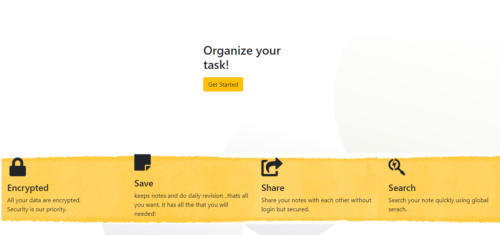
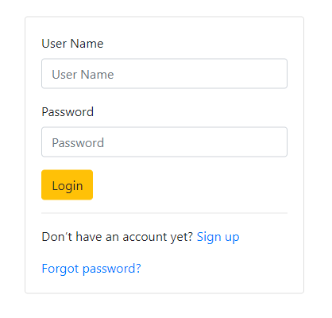

## Daily-To-Do-Task-Managment


Based on Djanago , secure and shareable.  Add daily activities , schedule your activity and add notes to do revision.

1. Add your notes to keep them fopr future use and you can revise them.

2. Add activities , Schedule activities

# Running the Project Locally

Create pipenv and install all dependencies.

```bash
pip install pipenv

$ pipenv install

$ pipenv shell
```

First, clone the repository to your local machine:

``` git clone https://github.com/mailtodanish/Daily-To-Do-Task-Managment.git ```

Install the requirements:

Apply the migrations:

dont forget to load applictaion data.

``` 
python manage.py migrate
python manage.py createsuperuser
python manage.py loaddata ApplictaionData.json 
```

Update your Secrate Key in seting.py
Finally, run the development server:
python manage.py runserver

### Screen Shot


